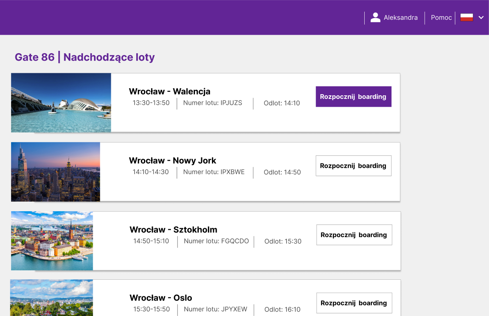
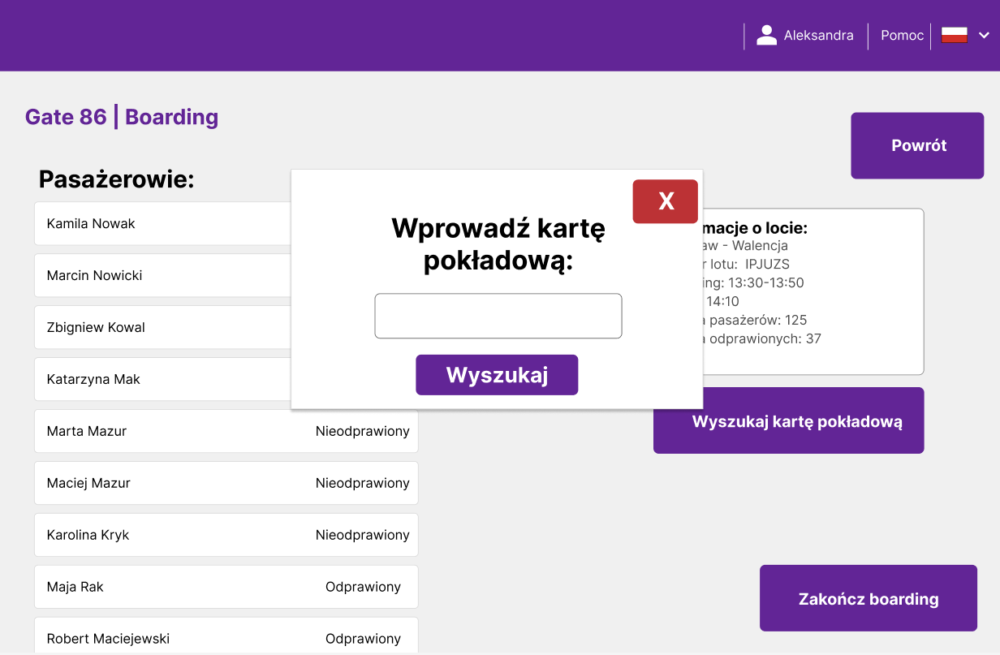

**Strona główna po zalogowaniu pracownika lotniska.**

**Po naciśnięciu przycisku "Rozpocznij boarding" pracownik widzi listę pasażerów, ich status oraz szczegóły lotu.**

**Po zeskanowaniu karty pokładowej pasażera, pracownik widzi jego dane, które może zatwierdzić po zweryfikowaniu.**

**Jeżeli zeskanowana karta pokładowa dotyczy innego lotu, to w szczegółach pasażera wyświetlony zostanie odpowiedni komunikat.**

**W przypadku niedziałającego skanera, pracownik po naciśnięciu "Wyszukaj kartę pokładową" może wprowadzić numer karty pokładowej, której nie udało się zeskanować.**

**Po naciśnięciu "Zakończ boarding" w przypadku jeżeli nie wszyscy pasażerowie przeszli boarding, zostanie wyświetlony odpowiedni komunikat.**

**Na koniec zostanie wyświetlony komunikat o pomyślnym zakończeniu boardingu.**

