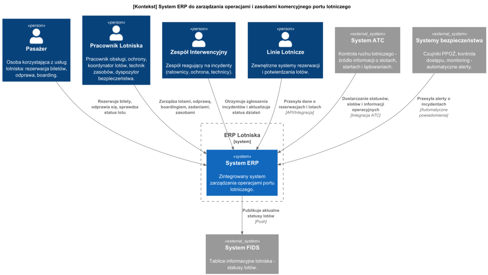
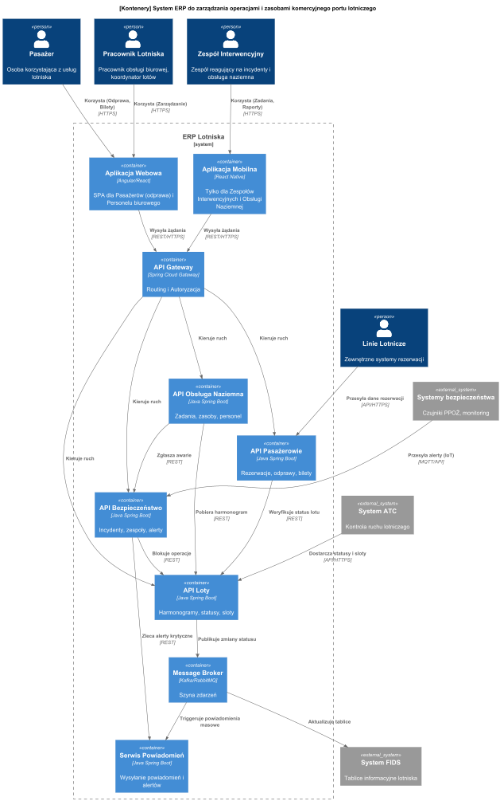

# Wyniki etapu II: Definicja architektury systemu

**Implementacja systemu ERP do zarządzania operacjami i zasobami komercyjnego portu lotniczego**

---

**Skład zespołu:**
+ Michał Klatkowski
+ Dominik Patrzek
+ Aleksandra Pluta
+ Łukasz Sokołowski

**Prowadzący:**
+ dr inż. Marcin Kawalerowicz

---

## 1. Cel
Dokument przedstawia decyzje architektoniczne, ich uzasadnienie oraz strukturę systemu ERP dla portu lotniczego. Dokument definiuje podział na komponenty, sposób ich komunikacji, rozmieszczenie oraz model danych, mając na celu zapewnienie skalowalności, niezawodności i bezpieczeństwa operacji lotniczych.

## 2. Cele i ograniczenia architektoniczne
Wyróżnione zostały następujące cele, które system powinien spełniać:

**Funkcjonalne:**
*   System umożliwia centralne zarządzanie harmonogramem lotów i integrację z kontrolą ruchu (ATC).
*   System umożliwia kompleksową obsługę pasażera: od rezerwacji, przez odprawę, po boarding.
*   System umożliwia zarządzanie zasobami naziemnymi i automatyczne przydzielanie zadań (np. tankowanie).
*   System umożliwia wykrywanie, koordynację i raportowanie incydentów bezpieczeństwa w czasie rzeczywistym.

**Niefunkcjonalne (zgodnie z WNF Etapu I):**
*   **Dostępność (WNF-1):** System musi być dostępny przez min. 99,99% czasu (maks. 52 minuty przestoju rocznie).
*   **Wydajność (WNF-3, WNF-4):** Czas aktualizacji FIDS < 5s; Czas odpowiedzi interfejsu < 2s; Obsługa 5000 transakcji/min.
*   **Bezpieczeństwo (WNF-6, WNF-8):** Autoryzacja oparta na rolach (RBAC), szyfrowanie TLS 1.2+.
*   **Integralność (WNF-7, WNF-9):** Niezmienialne logi audytowe; RPO (utrata danych) < 1 minuta.
*   **Interfejs:** System dostępny jako aplikacja webowa (personel biurowy) i mobilna (personel terenowy).

## 3. Decyzje i ich uzasadnienie
W poniższej tabeli przedstawiono zastosowane taktyki architektoniczne.

| Cel | Sposób osiągnięcia (Taktyki)                                                                                                                                                                                                                                                                               |
| :--- |:-----------------------------------------------------------------------------------------------------------------------------------------------------------------------------------------------------------------------------------------------------------------------------------------------------------|
| **1. Wysoka dostępność (99,99%) i Skalowalność** | **A. Architektura Mikroserwisów:** Podział systemu na niezależne domeny (Loty, Pasażerowie, Zasoby, Bezpieczeństwo) zapobiega kaskadowym awariom. **B. Klaster Kubernetes:** Automatyczne restartowanie i skalowanie instancji serwisów. **C. Load Balancing:** Rozłożenie ruchu pomiędzy instancje. |
| **2. Wydajność i Czas Reakcji** | **A. Event-Driven Architecture:** Asynchroniczna komunikacja między domenami (np. zmiana statusu lotu -> zadanie dla obsługi naziemnej) przy użyciu brokera wiadomości. **B. Caching:** Przechowywanie często odczytywanych danych (statusy lotów, SOP) w pamięci podręcznej.                           |
| **3. Bezpieczeństwo Danych** | **A. Centralny Identity Provider:** Uwierzytelnianie oparte o OAuth2 i tokeny JWT. **B. Segmentacja sieci:** Bazy danych ukryte w sieci prywatnej, dostęp tylko przez API Gateway.                                                                                                                      |
| **4. Integralność i Audytowalność** | **A. Dedykowany Serwis Audytowy:** Asynchroniczny zapis wszystkich operacji modyfikujących do bazy.                                                                                                                                                                                                        |
| **5. Dostępność Mobilna** | **A. API First:** Wszystkie funkcjonalności wystawione przez REST API, konsumowane przez aplikacje Web i Mobile.                                                                                                                                                                                           |

## 4. Mechanizmy architektoniczne

Poniżej przedstawiono mechanizmy architektoniczne wspierające wyżej wymienione taktyki.

**1A. Architektura Mikroserwisów**

System zostanie zaimplementowany jako zestaw niezależnie wdrażalnych usług (np. Loty, Pasażerowie). Każdy mikroserwis posiada własną bazę danych, co zapewnia izolację uszkodzeń. Komunikacja między nimi będzie realizowana za pomocą lekkich protokołów (REST lub Message Broker).

**1B. Klaster Kubernetes**

Wykorzystane zostanie narzędzie Kubernetes do orkiestracji kontenerów. Mechanizm ReplicaSet pozwoli na utrzymywanie zadanej liczby instancji każdego serwisu, zapewniając ich automatyczne skalowanie w górę lub w dół w zależności od obciążenia oraz restart w przypadku awarii.

**1C. Load Balancing** 

Za kierowanie ruchem użytkowników pomiędzy wieloma kopiami serwisów odpowiadać będzie Load Balancer (np. zintegrowany z bramą API Gateway). Zapewni to optymalne wykorzystanie zasobów obliczeniowych i wysoką dostępność.

**2A. Event-Driven Architecture (EDA)**

Komunikacja asynchroniczna zostanie oparta o brokera wiadomości (np. RabbitMQ lub Kafka). W przypadku zmiany statusu lotu, serwis Loty publikuje zdarzenie, które jest konsumowane przez zainteresowane moduły (np. Obsługa naziemna) bez blokowania wątku głównego, co poprawia czas reakcji systemu.

**2B. Caching** 

Często odczytywane i rzadko zmieniane dane (np. standardowe procedury operacyjne SOP lub aktualne statusy lotów) będą przechowywane w pamięci podręcznej Redis. Dane te będą zorganizowane w strukturę mapy (klucz-wartość) dla zapewnienia natychmiastowego dostępu.

**3A. Centralny Identity Provider (OAuth2/JWT)** 

Proces uwierzytelniania i autoryzacji zostanie zrealizowany w oparciu o standard JWT oraz biblioteki bezpieczeństwa (np. Spring Security). Każde zapytanie do API (poza logowaniem) musi zawierać ważny token; w przeciwnym razie system zwróci status 401 Unauthorized.

**3B. Segmentacja sieci i API Gateway** 

Wszystkie zapytania z zewnątrz trafiają do punktu wejścia – API Gateway, który pełni rolę bramy bezpieczeństwa. Bazy danych oraz serwisy wewnętrzne zostaną umieszczone w sieci prywatnej (VPC), odizolowanej od bezpośredniego dostępu z Internetu.

**4A. Dedykowany Serwis Audytowy** 

Mechanizm ten będzie przechwytywał zdarzenia modyfikacji danych w systemie i asynchronicznie zapisywał szczegóły operacji (kto, kiedy, co zmienił) do dedykowanej bazy audytowej. Zapobiegnie to utracie wydajności przy operacjach zapisu, zapewniając jednocześnie pełną historię zmian.

**5A. API First** 

Infrastruktura backendowa zostanie zbudowana w architekturze REST, wysyłając dane w formacie JSON. Dzięki temu ten sam zestaw usług może być efektywnie konsumowany przez aplikacje mobilne oraz webowe (SPA), co minimalizuje ilość przesyłanych danych.

## 5. Widoki architektoniczne

### 5.1 Widok kontekstowy

#### 5.1.1 Diagram kontekstowy

#### 5.1.2 Scenariusze interakcji

System ERP Lotniska jest centralnym węzłem wymiany informacji. Główne scenariusze interakcji obejmują:
1.  **Synchronizacja operacji lotniczych:** System ATC przesyła w czasie rzeczywistym informacje o slotach czasowych oraz statusach startów i lądowań. ERP Lotniska aktualizuje harmonogram i uruchamia procesy obsługi naziemnej.
2.  **Publikacja informacji pasażerskiej:** ERP Lotniska wypycha każdą zmianę statusu lotu, bramki lub czasu do systemu FIDS w celu wyświetlenia na tablicach w terminalu.
3.  **Monitoring bezpieczeństwa:** Systemy fizyczne (czujniki PPOŻ, kontrola dostępu) przesyłają sygnały alarmowe do ERP, który automatycznie tworzy incydenty i powiadamia personel.

#### 5.1.3 Interfejsy integracyjne – poziom logiczny

**Interfejs 1 - System ATC - ERP Lotniska**

| Opis | Status         |
| :--- |:---------------|
| Zewnętrzna usługa dostarczająca dane o ruchu lotniczym, slotach czasowych i pozwoleniach na start/lądowanie. Krytyczne źródło danych dla harmonogramowania. | **Istniejący** |

| | Aplikacja źródłowa | Aplikacja docelowa |
| :--- | :--- | :--- |
| **Nazwa aplikacji** | System ATC (Eurocontrol/PAŻP) | System ERP (Moduł Loty) |
| **Technika integracji** | AMQP / REST | AMQP / REST |
| **Mechanizm autentykacji** | mTLS (Mutual TLS) + API Key | mTLS (Mutual TLS) + API Key |

| |                                                                                                                                                  |
| :--- |:-------------------------------------------------------------------------------------------------------------------------------------------------|
| **Kontrakt danych** | Numer lotu, kod ICAO linii, czas planowany/rzeczywisty operacji, status operacji.                                                                |
| **Czy interfejs manipuluje na danych wrażliwych (RODO)?** | Nie. Przesyłane są tylko dane operacyjne lotów.                                                                                                  |
| **Strona inicjująca** | System ATC                                                                                                                                       |
| **Model komunikacji** | Asynchroniczny dla statusów, Synchroniczny dla pobrania planu sezonowego.                                                                        |
| **Wydajność** | Zależna od natężenia ruchu lotniczego. Szacowane piki: - 50 komunikatów na minutę w godzinach szczytu. - Łącznie ok. 3000 wywołań na dobę. |
| **Wolumetria** | Waga pojedynczego komunikatu JSON to ok. 2 KB. - 100 KB na minutę w szczycie. - ok. 6-10 MB danych na dobę.                                |
| **Wymagana dostępność** | **99,99%**. Jest to interfejs krytyczny. Brak danych z ATC paraliżuje planowanie obsługi naziemnej.                                              |

 

**Interfejs 2 - ERP Lotniska - System FIDS**

| Opis | Status |
| :--- | :--- |
| Interfejs zasilający publiczne tablice informacyjne w terminalu (przyloty/odloty/bramki). Zapewnia pasażerom aktualną informację wizualną. | **Projektowany** |

| | Aplikacja źródłowa | Aplikacja docelowa |
| :--- | :--- | :--- |
| **Nazwa aplikacji** | System ERP (Moduł Loty/Powiadomienia) | System FIDS (Kontrolery ekranów) |
| **Technika integracji** | WebSocket | WebSocket |
| **Mechanizm autentykacji** | Token JWT (Service-to-Service) | Token JWT (Service-to-Service) |

| |                                                                                                  |
| :--- |:-------------------------------------------------------------------------------------------------|
| **Kontrakt danych** | Numer lotu, kierunek, godzina, numer bramki, status (np. "Boarding", "Delayed"), uwagi.          |
| **Czy interfejs manipuluje na danych wrażliwych (RODO)?** | Nie. Dane są publiczne.                                                                          |
| **Strona inicjująca** | System ERP (przy każdej zmianie danych)                                                          |
| **Model komunikacji** | Asynchroniczny                                                                                   |
| **Wydajność** | Aktualizacje wysyłane są tylko przy zmianie stanu. - Szacowane 5000 aktualizacji na dobę.     |
| **Wolumetria** | Bardzo mała waga komunikatów (tekstowe). - ok. 0.5 KB na komunikat. - ok. 2.5 MB na dobę.  |
| **Wymagana dostępność** | **99,9%**. Awaria FIDS powoduje dezorientację pasażerów, ale nie zatrzymuje operacji lotniczych. |

 

**Interfejs 3 - Systemy bezpieczeństwa (czujniki) - ERP Lotniska**

| Opis | Status |
| :--- | :--- |
| Odbiór sygnałów z infrastruktury fizycznej: systemy przeciwpożarowe, kontrola dostępu. Pozwala na automatyczną detekcję incydentów. | **Istniejący** |

| | Aplikacja źródłowa | Aplikacja docelowa |
| :--- | :--- | :--- |
| **Nazwa aplikacji** | Bramka IoT / Koncentrator czujników | System ERP (Moduł Bezpieczeństwa) |
| **Technika integracji** | MQTT | MQTT |
| **Mechanizm autentykacji** | Certyfikaty X.509 (dla urządzeń) | Certyfikaty X.509 (dla urządzeń) |

| |                                                                                                                                                           |
| :--- |:----------------------------------------------------------------------------------------------------------------------------------------------------------|
| **Kontrakt danych** | ID czujnika, kod strefy, typ alarmu (np. "SMOKE_DETECTED", "DOOR_FORCED"), timestamp.                                                                     |
| **Czy interfejs manipuluje na danych wrażliwych (RODO)?** | Zależnie od typu alertu.  - PPOŻ: Nie. - Kontrola dostępu: Tak (może zawierać ID pracownika naruszającego strefę).                                  |
| **Strona inicjująca** | Systemy bezpieczeństwa                                                                                                                                    |
| **Model komunikacji** | Asynchroniczny                                                                                                                                            |
| **Wydajność** | W normalnych warunkach ruch minimalny ("heartbeat"). W sytuacji kryzysowej system musi obsłużyć nagły skok do 1000 zdarzeń/sekundę.                       |
| **Wolumetria** | Payload binarny lub lekki JSON. - Heartbeat: ciągły strumień danych o niskim wolumenie. - Alerty: sporadyczne, niska waga danych, wysoki priorytet. |
| **Wymagana dostępność** | **99,99%**. Interfejs krytyczny dla bezpieczeństwa życia i zdrowia.                                                                                       |

## 6. Widok funkcjonalny

Poniżej przedstawiono diagram kontenerów systemu ERP. Obrazuje on podział systemu na aplikacje klienckie, bramę API oraz autonomiczne mikroserwisy realizujące logikę poszczególnych domen. Linie na diagramie reprezentują kanały komunikacji (synchronicznej REST oraz asynchronicznej poprzez Broker).

### Przeznaczenie poszczególnych mikroserwisów

**API Loty:**
*   Jako planista chcę mieć możliwość tworzenia i edycji harmonogramów lotów, uwzględniając sloty czasowe.
*   Jako koordynator chcę otrzymywać automatyczne aktualizacje statusów (start/lądowanie) z systemu ATC, aby zarządzać operacjami w czasie rzeczywistym.
*   System umożliwia automatyczne publikowanie zmian statusów lotów na tablicach FIDS.

**API Pasażerowie:**
*   Jako pasażer chcę mieć możliwość odprawy online, wyboru miejsca i pobrania karty pokładowej.
*   Jako pracownik gate'u chcę mieć możliwość zeskanowania karty pokładowej, aby zweryfikować uprawnienia pasażera do wejścia na pokład.
*   System umożliwia weryfikację, czy dany lot istnieje i czy jest otwarty do odprawy (komunikacja z API Loty).

**API Bezpieczeństwo:**
*   Jako dyspozytor chcę widzieć automatyczne alerty z czujników PPOŻ i KD, aby natychmiast reagować na zagrożenia.
*   Jako dyspozytor chcę mieć możliwość przydzielenia incydentu do zespołu interwencyjnego i monitorowania jego statusu.
*   System zapewnia niezmienialny rejestr działań (Audit Log) dla wszystkich operacji krytycznych.
*   System umożliwia automatyczne zablokowanie operacji lotniczych w przypadku incydentu krytycznego (komunikacja z API Loty).

**API Obsługa Naziemna:**
*   Jako kierownik zasobów chcę zarządzać dostępnością sprzętu i personelu naziemnego.
*   Jako pracownik obsługi chcę otrzymywać na urządzenie mobilne listę zadań (np. tankowanie) powiązanych z konkretnym lotem.
*   Jako pracownik chcę mieć możliwość zgłoszenia awarii sprzętu, co automatycznie utworzy incydent techniczny (komunikacja z API Bezpieczeństwo).

**Infrastruktura (API Gateway & Broker):**
Serwisy **API Gateway** oraz **Message Broker** nie realizują bezpośredniej logiki biznesowej widocznej dla użytkownika końcowego, jednak zostały wprowadzone jako kluczowe elementy infrastruktury:
*   **API Gateway:** Odpowiada za routing, autoryzację (JWT) i bezpieczeństwo styku z siecią publiczną.
*   **Message Broker:** Gwarantuje niezawodność komunikacji asynchronicznej i separację domen.

## 7. Widok rozmieszczenia

## 8. Widok informacyjny

**8.1 Model informacyjny**

**8.2 Projekt bazy danych**

| Ogólne informacje nt. bazy danych |  |
|---|--|
| SID/Service Name | Pasazerowie-i-odprawy |
| Nazwa serwera | pasazerowie-odprawy-db |
| Port | 5432 |
| Type | Relacyjna – Postgres 16 |
| Kodowanie znaków | UTF-8 |
| Opis | Baza danych do zarządzania pasażerami, rezerwacjami, odprawami, bagażami, kartami pokładowymi oraz procesami boardingu i kontroli bezpieczeństwa. |

| Backup |
|-------|
| Dane krytyczne biznesowo. Pełna kopia zapasowa wykonywana codziennie w godzinach nocnych (03:00). Kopie przyrostowe archiwizowane co 15 minut. Retencja kopii pełnych: 30 dni.
|

| Informacje o schemacie    | |
|---|--|
| Nazwa                     | public |
| Początkowa pojemność      | ≈10MB |
| Przyrost pojemności (rok) | ≈80GB |

| Ogólne informacje nt. bazy danych |                                                                                                                                           |
|---|-------------------------------------------------------------------------------------------------------------------------------------------|
| SID/Service Name | Loty-i-harmonogramy                                                                                                                       |
| Nazwa serwera | loty-harmonogramy-db                                                                                                                      |
| Port | 5432                                                                                                                                      |
| Type | Relacyjna – Postgres 16                                                                                                                   |
| Kodowanie znaków | UTF-8                                                                                                                                     |
| Opis | Baza danych do zarządzania harmonogramami lotów, slotami czasowymi, przydziałem zasobów, statusami lotów, danymi samolotów oraz załogami. |

| Backup |
|-------|
|Dane o statusie Mission Critical. Replikacja synchroniczna do instancji zapasowej. Pełny backup codziennie. Kopie przyrostowe w czasie rzeczywistym. Możliwość odtworzenia stanu z dowolnego momentu z ostatnich 7 dni.
|

| Informacje o schemacie    |        |
|---|--------|
| Nazwa                     | public |
| Początkowa pojemność      | ≈20MB  |
| Przyrost pojemności (rok) | ≈30GB  |

| Ogólne informacje nt. bazy danych |                                                                                                                                                                                                     |
|---|-----------------------------------------------------------------------------------------------------------------------------------------------------------------------------------------------------|
| SID/Service Name | Bezpieczenstwo-i-incydenty                                                                                                                                                                          |
| Nazwa serwera | bezpieczenstwo-incydenty-db                                                                                                                                                                         |
| Port | 5432                                                                                                                                                                                                |
| Type | Relacyjna – Postgres 16                                                                                                                                                                             |
| Kodowanie znaków | UTF-8                                                                                                                                                                                               |
| Opis | Baza danych do rejestracji, kategoryzacji, priorytetyzacji i zarządzania incydentami, koordynacji zespołów interwencyjnych, logowania działań, powiadomień oraz integracji z systemami monitoringu. |

| Backup |
|-------|
| Backup pełny co 24h. Logi transakcyjne archiwizowane w trybie ciągłym. Dane historyczne (starsze niż 1 rok) przenoszone do taniego magazynu danych w celu archiwizacji długoterminowej (5 lat).     |

| Informacje o schemacie    |        |
|---|--------|
| Nazwa                     | public |
| Początkowa pojemność      | ≈20MB  |
| Przyrost pojemności (rok) | ≈20GB  |

| Ogólne informacje nt. bazy danych |                                                                                                                                           |
|---|-------------------------------------------------------------------------------------------------------------------------------------------|
| SID/Service Name | Obsluga-naziemna-i-zasoby                                                                                                                 |
| Nazwa serwera | osluga-naziemna-zasoby-db                                                                                                                 |
| Port | 5432                                                                                                                                      |
| Type | Relacyjna – Postgres 16                                                                                                                   |
| Kodowanie znaków | UTF-8                                                                                                                                     |
| Opis | Baza danych do zarządzania zasobami naziemnymi, przydziałem zadań, planowaniem zmian, kwalifikacjami, logowaniem statusów oraz integracją z systemami lotów, bezpieczeństwa i logistyki.|

| Backup |
|-------|
|  Backup pełny raz dziennie. Kopie przyrostowe co 1 godzinę. Retencja danych operacyjnych w głównej bazie: 6 miesięcy, starsze dane archiwizowane.
|

| Informacje o schemacie    |        |
|---|--------|
| Nazwa                     | public |
| Początkowa pojemność      | ≈30MB  |
| Przyrost pojemności (rok) | ≈40GB  |

## 9. Widok wytwarzania

## 10. Realizacja przypadków użycia