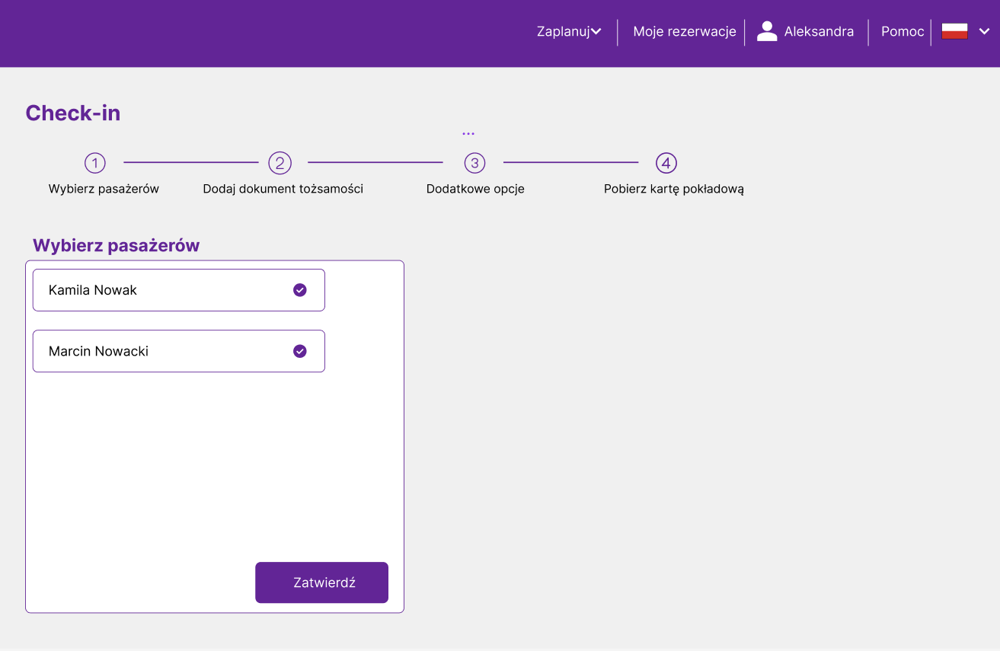

**Strona główna po zalogowaniu pasażera**

**Po naciśnięciu przycisku "Moje rezerwacje" pasażer widzi wszystkie jego rezerwacje: zarówno poprzednie, jak i nadchodzące.**

**Po naciśnięciu linku "check-in" przy danej rezerwacji pasażer zostaje przekierowany do widoku, gdzie wybiera, których pasażerów chce odprawić.**

**Po wybraniu pasażerów do odprawy i naciśnięciu przycisku "Przejdź dalej" pasażer zostaje przekierowany do strony, na której zostaje poproszony o uzupełnienie informacji dotyczących dowodu tożsamości każdego z odprawianych pasażerów.**

**Jeżeli pasażer nie uzupełni wszystkich danych to zostanie wyświetlony komunikat o niepoprawnych danych.**

**Po poprawnym uzupełnieniu danych i naciśnięciu "Przejdź dalej" pasażer zostaje przekierowany do widoku, gdzie może wybrać rodzaj bagażu, jaki ze sobą zabiera każdy z pasażerów.**

**Po wybraniu bagażu, pasażer może wybrać miejsca w samolocie.**

**Jeżeli pasażer wybrał miejsca i zrezygnował z losowego przydziału to wybiera metodę płatności.**

**Na koniec pasażer otrzymuje karty pokładowe z opcją pobrania i wydruku.**
