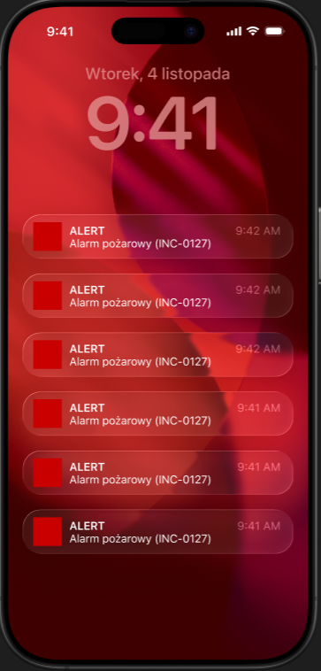
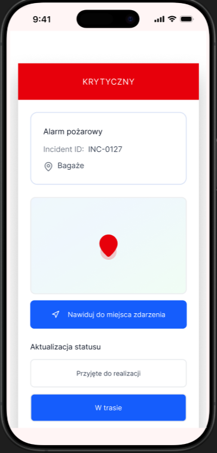
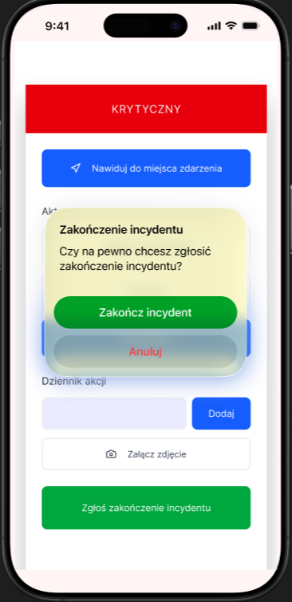
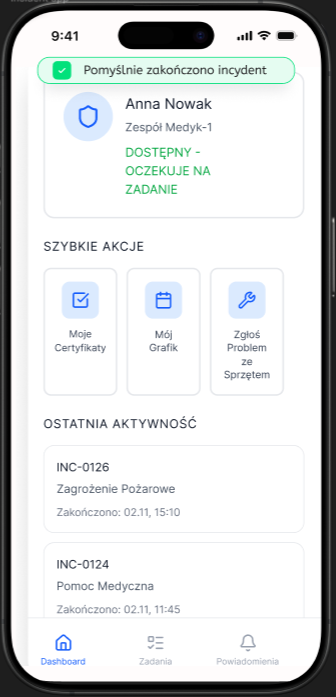

**Na urządzeniu mobilnym pojawia się powiadomienie o przypisaniu do incydentu, wysyłane co 5 sekund.**

**Po kliknięciu w powiadomienie, Członek zespołu interwencyjnego widzi incydent, jego szczegóły oraz pola do aktualizacji.**

**Po zmianie statusu incydentu, użytkownik otrzymuje informację o pomyślnym działaniu.**

**Członek zespołu interwencyjnego aktualizuje dziennik akcji poprzez wypełnienie pola tekstowego.**

**Po dodaniu akcji w dzienniku, Członek zespołu interwencyjnego otrzymuje potwierdzenie.**

**Po kliknięciu przycisku 'Zgłoś zakończenie incydentu', wyświetla się modal z potwierdzeniem działania.**

**Po zatwierdzeniu zakończenia incydentu, Członek zespołu interwencyjnego otrzymuje komunikat i jest przenoszony do panelu głównego aplikacji.**
