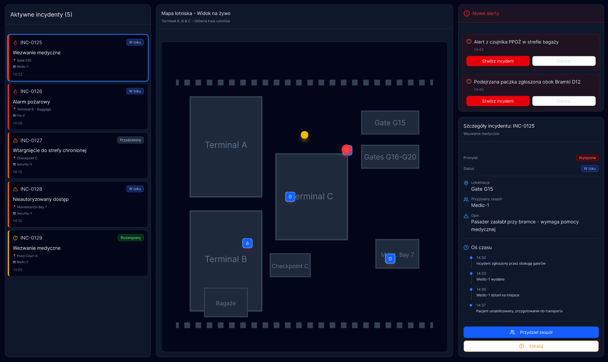
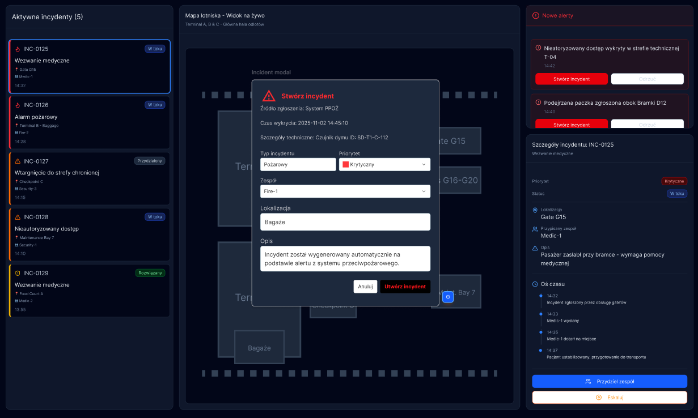
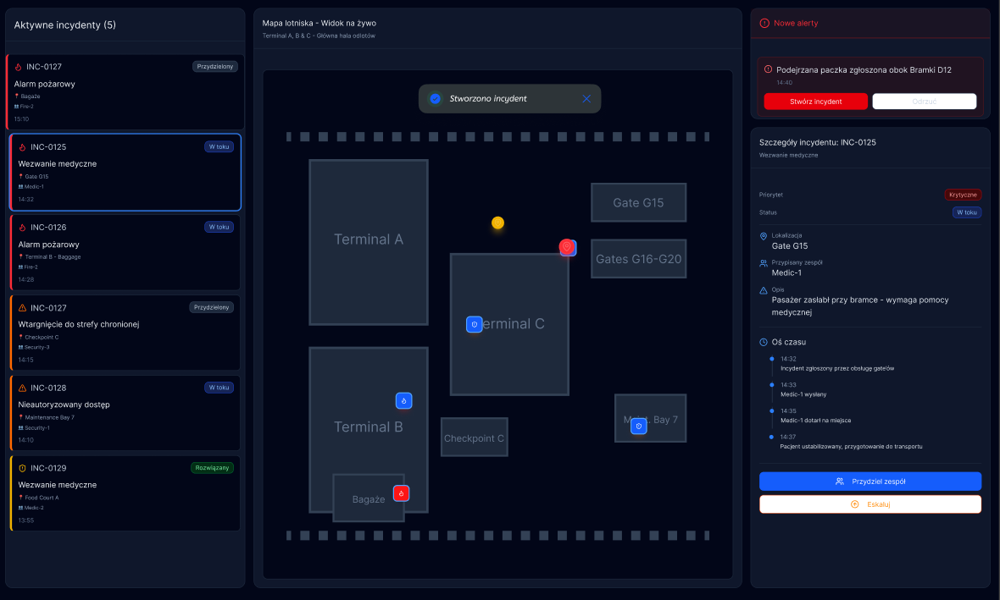

**Centrum zarządzania incydentami lotniskowymi, po lewej stronie znajdują się aktywne incydenty zawierające najważniejsze informacje wraz z statusem. Pośrodku mapa lotniska wraz z pinezkami na mapie wskazującymi na incydenty. Po prawej alerty pochodzące z czujników/ innych źródeł, potencjalne źródło incydentów. Niżej szczegóły wybranego incydentu.**

**Gdy alert wskazuje na ryzyko, po kliknięciu przycisku 'Stwórz incydent', pojawia się modal tworzenia incydentu, należy wypełnić pola wszystkie pola formularza.**

**Po stworzeniu incydentu, pojawia się on w panelu aktywnych incydentów i mapie, znika z pola 'Nowe alerty', pokazuje się również potwierdzenie dodania incydentu.**
